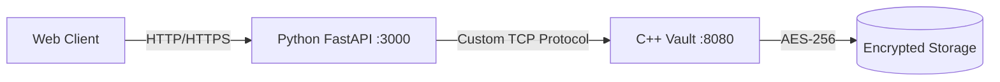

# SafeDrop – Secure Ephemeral File Exchange System

**SafeDrop** is a high-performance, hybrid secure file transfer system designed for ephemeral messaging ("Burn-on-Read"). It leverages a **C++ Core** for low-level socket management, encryption, and secure file deletion, bridged with a **Python FastAPI** layer for modern web access and user authentication.

## 🚀 Key Features

  * **Hybrid Architecture:** Combines the raw performance of **C++17** for the heavy lifting (encryption, IO) with the flexibility of **Python 3.11** for the REST API and business logic.
  * **Custom Binary Protocol:** Implements a specialized TCP packet structure (`Magic Bytes` + `Metadata` + `Payload`) to ensure data integrity and prevent file header corruption (e.g., fixing PNG/PDF header collisions).
  * **AES-256 Encryption:** Every file is encrypted server-side using **OpenSSL (EVP Interface)** with unique, randomly generated Initialization Vectors (IVs) per transaction.
  * **Burn-on-Read Logic:** Files are not just "hidden"—they are physically removed from the disk (`std::remove`) by the C++ core immediately after the download limit or expiration timer is reached.
  * **Zero-Knowledge Downloads:** The Python API streams encrypted data directly from the Core to the Client without caching unencrypted versions on disk.

## 🛠️ Technology Stack

  * **Core Server:** C++17, OpenSSL, Native POSIX Sockets.
  * **Web API:** Python (FastAPI), Uvicorn, SQLAlchemy, Python-Jose (JWT).
  * **Database:** SQLite (Relational metadata storage).
  * **Frontend:** HTML5, CSS3 (Glassmorphism UI), Vanilla JavaScript.

## ⚙️ Architecture

The system consists of two independent microservices communicating over a local TCP socket:

1.  **The Vault (C++):** Listens on port `8080`. It handles raw bytes, performs AES-256 encryption/decryption, and enforces the "Burn" logic.
2.  **The Gateway (Python):** Listens on port `3000`. It handles User Auth (Login/Register), serves the UI, and proxies file streams to The Vault.

<!-- end list -->



## 🔧 Installation & Setup

### 1\. Prerequisites

  * **C++ Compiler:** `g++` (supporting C++17) or `clang`.
  * **OpenSSL:** Development libraries (`libssl-dev` or `openssl@3` on macOS).
  * **Python:** Version 3.9+.

### 2\. Compile the C++ Core

You can use `cmake` (recommended) or `g++` directly.

**Option A: Using CMake**

```bash
mkdir build && cd build
cmake ..
make
mv server ../  # Move binary to root
```

**Option B: Manual Compilation (macOS Apple Silicon)**

```bash
arch -x86_64 g++ -std=c++17 src/Server.cpp src/FileHandler.cpp src/CryptoHandler.cpp -o server -I"$(brew --prefix openssl@3)/include" -L"$(brew --prefix openssl@3)/lib" -lssl -lcrypto
```

**Option C: Manual Compilation (Linux)**

```bash
g++ -std=c++17 src/Server.cpp src/FileHandler.cpp src/CryptoHandler.cpp -o server -lssl -lcrypto
```

### 3\. Setup Python Environment

```bash
pip install fastapi uvicorn python-dotenv sqlalchemy passlib python-jose[cryptography] argon2-cffi python-multipart
```

### 4\. Configuration

Create a `.env` file in the project root:

```ini
SECRET_KEY="your_super_secret_jwt_key"
ALGORITHM="HS256"
CPP_SERVER_IP="127.0.0.1"
CPP_SERVER_PORT=8080
```

## 🏃‍♂️ Usage

1.  **Start the C++ Vault:**

    ```bash
    ./server
    ```

    *Output:* `>>> SafeDrop Core V3 (Magic Bytes Enabled)...`

2.  **Start the Python API (in a new terminal):**

    ```bash
    python3 api.py
    ```

    *Output:* `Uvicorn running on http://0.0.0.0:3000`

3.  **Access the Interface:**
    Open your browser and navigate to `http://localhost:3000`.

## 📸 Web Interface Screenshots

Here is a glimpse of the SafeDrop user interface.

**Login Screen**
<br>
https://github.com/chinanuj/SafeDrop/blob/5c59d3dafeb3ed6291e95abc4a9396cf029e69ac/docs/images/login_screenshot.png
**Secure Chat & File Drop**
<br>
https://github.com/chinanuj/SafeDrop/blob/5c59d3dafeb3ed6291e95abc4a9396cf029e69ac/docs/images/chat_screenshot.png

## 🛡️ Security Protocol (V3)

The system uses a custom header to prevent attacks and data corruption:

| Byte Offset | Size | Field | Description |
| :--- | :--- | :--- | :--- |
| 0 | 1 | Command | `U` (Upload) or `D` (Download) |
| 1-2 | 2 | Magic Bytes | `0xBEEF` (Safety Check) |
| 3-6 | 4 | Limit | Max download count (Big Endian) |
| 7-10 | 4 | Expiry | Time-to-live in seconds (Big Endian) |
| 11+ | N | Payload | File Extension + Content |
